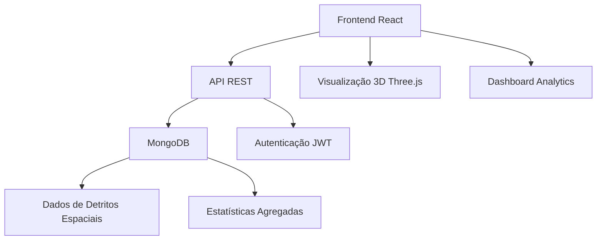

<div align="center">

# 🌌 Space Debris Visualization

### *Mapeando a Ameaça Invisível Acima*


---

*Explore mais de **16.308** pedaços de lixo espacial orbitando a Terra a **28.000+ km/h** através de uma visualização 3D interativa revolucionária.*

[🚀 **Explorar Demo**](#-demonstração) • [📊 **Ver Estatísticas**](#-estatísticas) • [🛠️ **Instalação**](#-instalação) • [📚 **Documentação**](#-documentação)

</div>

---

## 🎯 **Sobre o Projeto**

O **Space Debris Visualization** é uma aplicação web interativa que torna visível e acessível o problema crítico do lixo espacial. Transformamos dados complexos de detritos orbitais em informações claras e visuais para apoiar decisões estratégicas e conscientizar a sociedade sobre os riscos da **Síndrome de Kessler**.

### 🌟 **Características Principais**

- **🌍 Visualização 3D Interativa**: Explore a Terra e seus detritos orbitais em tempo real
- **📊 Dashboard Analítico**: Estatísticas detalhadas por país, empresa, tipo de órbita e massa
- **🔍 Sistema de Busca Avançado**: Filtre objetos por múltiplos critérios
- **📱 Design Responsivo**: Interface moderna e futurística adaptável a qualquer dispositivo
- **⚡ Performance Otimizada**: Renderização eficiente de milhares de objetos espaciais
- **🎓 Seção Educativa**: Aprenda sobre os riscos e impactos do lixo espacial

---

## 🚀 **Demonstração**

### 🌌 **Interface Principal**
- **Hero Section**: Apresentação impactante com estatísticas em tempo real
- **Visualização 3D**: Modelo interativo da Terra com detritos orbitais
- **Painel de Controle**: Filtros avançados e opções de visualização
- **Detalhes dos Objetos**: Informações técnicas completas ao clicar

### 📊 **Dashboard de Estatísticas**
- **Distribuição por País**: Visualize quais nações mais contribuem para o lixo espacial
- **Análise por Empresa**: Identifique as principais organizações responsáveis
- **Classificação Orbital**: LEO, MEO e GEO com distribuição detalhada
- **Distribuição por Peso**: Análise de massa dos objetos com médias por categoria

---

## 🛠️ **Tecnologias Utilizadas**

### **Frontend**
```
🎨 React 18 + TypeScript
⚡ Vite (Build Tool)
🎯 Three.js (Visualização 3D)
💎 Tailwind CSS + shadcn/ui
📊 Recharts (Gráficos)
🔄 TanStack Query (Estado)
🎭 Framer Motion (Animações)
```

### **Backend**
```
🚀 Node.js + Express
🗄️ MongoDB (Base de Dados)
🔐 JWT (Autenticação)
📡 RESTful API
🐳 Docker (Containerização)
```

### **Ferramentas de Desenvolvimento**
```
📦 npm/bun (Gerenciamento de Pacotes)
🔧 ESLint + Prettier (Qualidade de Código)
🐳 Docker Compose (Orquestração)
```

---

## 📊 **Estatísticas do Projeto**

<div align="center">

| Métrica | Valor |
|---------|-------|
| 🛰️ **Objetos Rastreados** | 16.308 |
| 🌍 **Países Representados** | 50+ |
| 🏢 **Empresas/Organizações** | 200+ |
| 📡 **Tipos de Órbita** | LEO, MEO, GEO |
| ⚖️ **Faixa de Massa** | 0.1kg - 8.000kg |
| 📅 **Período de Dados** | 1957 - 2025 |

</div>

---

## 🏗️ **Arquitetura do Sistema**



### **Estrutura de Pastas**
```
hackaton-projeto/
├── 📁 frontend/                 # Aplicação React
│   ├── 📁 src/
│   │   ├── 📁 components/       # Componentes reutilizáveis
│   │   ├── 📁 pages/           # Páginas da aplicação
│   │   ├── 📁 hooks/           # Custom hooks
│   │   └── 📁 lib/             # Utilitários
│   ├── 📁 RenderTerra/         # Visualização 3D
│   └── 📄 package.json
├── 📁 backend/                  # API Node.js
│   ├── 📁 router/              # Rotas da API
│   ├── 📁 model/               # Modelos de dados
│   ├── 📁 control/             # Controladores
│   ├── 📁 middleware/          # Middlewares
│   └── 📄 package.json
└── 📄 docker-compose.yml       # Orquestração
```

---

## ⚙️ **Instalação**

### **Pré-requisitos**
- Node.js 18+
- MongoDB
- Docker (opcional)

### **1. Clone o Repositório**
```bash
git clone https://github.com/seu-usuario/hackaton-projeto.git
cd hackaton-projeto
```

### **2. Configuração do Backend**
```bash
cd backend
npm install

# Configure as variáveis de ambiente
cp .env.example .env
# Edite o arquivo .env com suas configurações

# Inicie o servidor
npm run dev
```

### **3. Configuração do Frontend**
```bash
cd frontend
npm install

# Inicie o servidor de desenvolvimento
npm run dev
```

### **4. Usando Docker (Alternativa)**
```bash
# Na raiz do projeto
docker-compose up -d
```

### **5. Acesse a Aplicação**
- **Frontend**: http://localhost:8080
- **Backend API**: http://localhost:3000
- **Visualização 3D**: http://localhost:8080/RenderTerra

---

## 🔌 **API Endpoints**

### **Detritos Espaciais**
```http
GET /space_debris/count          # Contagem total
GET /space_debris/filtered       # Lista filtrada
GET /space_debris/statistics     # Estatísticas agregadas
GET /space_debris/countries      # Países únicos
GET /space_debris/companies      # Empresas únicas
```

### **Parâmetros de Filtro**
```javascript
{
  limit: number,        // Limite de resultados
  offset: number,       // Paginação
  country: string,      // Filtro por país
  company: string,      // Filtro por empresa
  type: number,         // Tipo (1=Satélite, 2=Foguete, 3=Detrito)
  minMass: number,      // Massa mínima
  maxMass: number,      // Massa máxima
  search: string        // Busca textual
}
```

---

## 🎨 **Componentes Principais**

### **🌟 Hero Section**
- Apresentação impactante com estatísticas
- Animações CSS avançadas
- Campo de estrelas animado
- Botões de ação com efeitos 3D

### **🌍 Visualização 3D**
- Modelo da Terra com texturas realistas
- Renderização de 16.000+ objetos
- Controles de câmera intuitivos
- Sistema de informações detalhadas

### **📊 Dashboard Analytics**
- Gráficos interativos com Recharts
- Filtros dinâmicos
- Estatísticas em tempo real
- Distribuições por múltiplos critérios

### **🎓 Seção Educativa**
- Informações sobre Síndrome de Kessler
- Impactos ambientais e econômicos
- Soluções e tecnologias de mitigação

---

## 🌐 **Funcionalidades Avançadas**

### **🔍 Sistema de Busca**
- Busca textual inteligente
- Filtros combinados
- Resultados paginados
- Ordenação customizável

### **📱 Responsividade**
- Design mobile-first
- Breakpoints otimizados
- Touch gestures na visualização 3D
- Interface adaptativa

### **⚡ Performance**
- Lazy loading de componentes
- Virtualização de listas grandes
- Otimização de renderização 3D
- Cache inteligente de dados

---

## 🤝 **Contribuição**

Contribuições são bem-vindas! Para contribuir:

1. **Fork** o projeto
2. Crie uma **branch** para sua feature (`git checkout -b feature/AmazingFeature`)
3. **Commit** suas mudanças (`git commit -m 'Add some AmazingFeature'`)
4. **Push** para a branch (`git push origin feature/AmazingFeature`)
5. Abra um **Pull Request**

### **Diretrizes de Contribuição**
- Siga os padrões de código estabelecidos
- Adicione testes para novas funcionalidades
- Documente mudanças significativas
- Mantenha commits limpos e descritivos

---

## 📝 **Licença**

Este projeto está licenciado sob a **MIT License** - veja o arquivo [LICENSE](LICENSE) para detalhes.

---

## 👥 **Equipe**

<div align="center">

**Desenvolvido com ❤️ para conscientizar sobre os riscos do lixo espacial**

*"O espaço é o patrimônio comum da humanidade. Protegê-lo é nossa responsabilidade coletiva."*

---

### 🌟 **Se este projeto foi útil, considere dar uma estrela!**

[](https://github.com/seu-usuario/hackaton-projeto/stargazers)

</div>

---

<div align="center">

**🚀 [Explorar Demo](http://localhost:8080) • 📊 [Ver API](http://localhost:3000) • 🌍 [Visualização 3D](http://localhost:8080/RenderTerra)**

*Transformando dados complexos em conhecimento acessível*

</div>